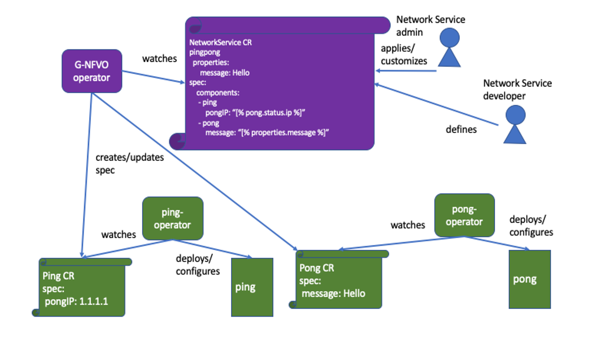

## Demo Architecture

### VNFs on Kubernetes



The involved operators:

1. [gnf-orchestrator] (../../)
1. [ping-operator](ping-operator)
1. [pong-operator](pong-operator)

The application code: [Ping-pong sample](ping-pong-sample)

## CRDs

```
apiVersion: gnforchestrator.ibm.com/v2alpha1
kind: NetworkService
metadata:
  name: example-pingpong
  labels:
    service: pingpong
spec:
  properties:
    message: Hello
  components:
    ping:
      template:
        apiVersion: ping.example.com/v1alpha1
        kind: Ping
        metadata:
          name: "[% meta.name %]-ping"
          namespace: "[% meta.namespace %]"
        spec:
          pingVersion: v1.0
          pongAddress: "[% pong.status.ip %]"
          pongPort: "[% pong.status.port %]"
    pong:
      template:
        apiVersion: pong.example.com/v1alpha1
        kind: Pong
        metadata:
          name: "[% meta.name %]-pong"
          namespace: "[% meta.namespace %]"
        spec:
          pongVersion: v1.4
          message: "[% message %]"
          minReplicas: "[% replicas*2 %]"
          maxReplicas: "[% replicas*3 %]"
  replicas: 2
  statusTemplate:
    ip: "[% ping.status.ip %]"
    port: "[%.ping.status.port %]"
status:
  ip: 1.1.1.1 # IP from the status of ping
  port: 6003 # port from the status of ping
```

## Demo script - Ping and Pong on Kuberneters/Openshift

* [Ping and Pong on Kubernetes](k8s.md)
