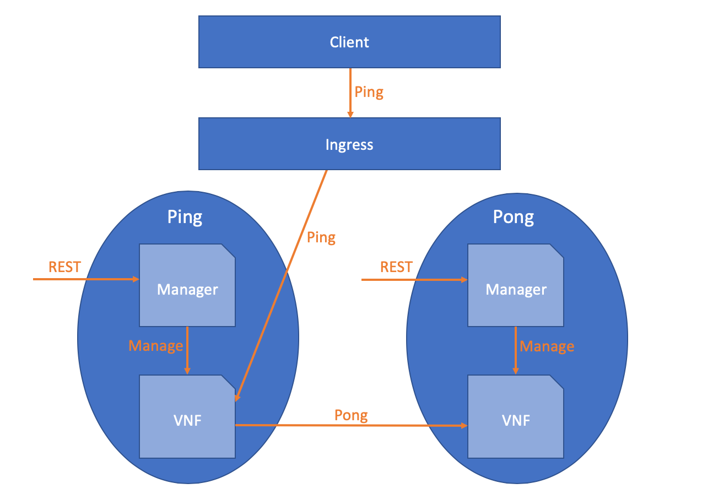
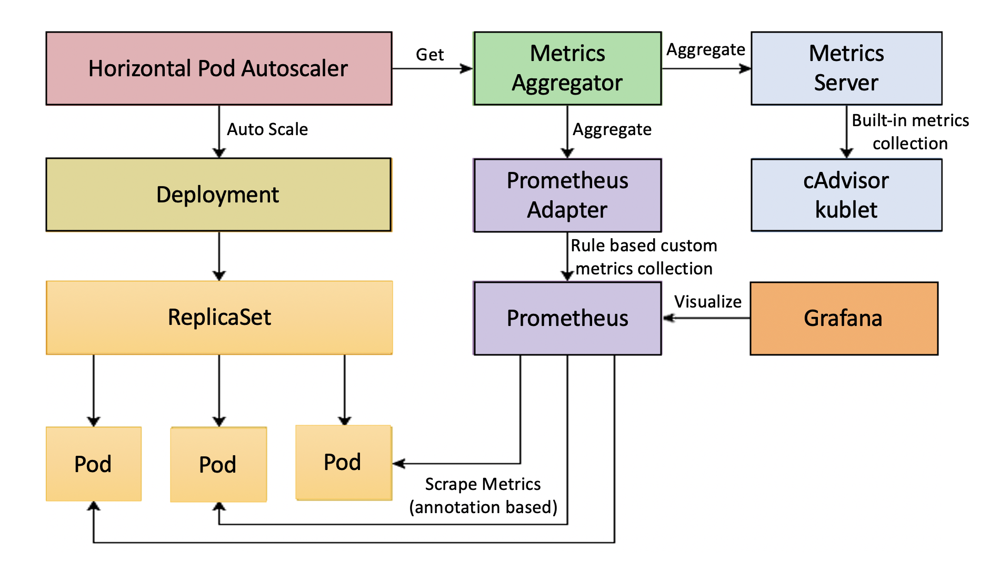

# ping-pong-sample

This sample demonstrates two VNFs, Ping and Pong.   
Each VNF has a VNF Manager that is used for management of that VNF.  
The VNF Manager might be Element Manager (EM) or Specific VNFM according to [ETSI MANO](https://www.etsi.org/technologies/nfv) stanard.  
The code of all components is written in GO.  

# High level overview




## Ping VNF Manager

Ping VNF Manager expects to find in the environment variables the following keys:
```
VNFMANAGER_PORT=...
VNF_ADDRESS=...
VNF_MANAGEMENT_PORT=...
```

* `VNFMANAGER_PORT` is the port that Ping VNF Manager will listen on to get REST calls.
* `VNF_ADDRESS` is the address of Ping VNF (to allow VNF Manager managing the VNF).
* `VNF_MANAGEMENT_PORT` the port the VNF is listening for calls from VNF Manager (management calls).

#### Ping VNF Manager REST API

* `GET /hello` returns `Hello from ping VNF Manager`(for liveness check)
* `POST /configure` configures Ping VNF with the given configuration.  
The call expects to get Ping's VNF configuration in the request body.  
Ping's VNF configuration includes pong's VNF address and port in the following format:  
```
{
    "pongAddress": "localhost",
    "pongPort": "6006"
}
```
## Ping VNF

Ping VNF expects to find in the environment variables the following keys:
```
VNF_MANAGEMENT_PORT=...
VNF_FUNCTIONAL_PORT=...
VNF_VERSION=...
```

* `VNF_MANAGEMENT_PORT` the port the VNF is listening for calls from VNF Manager (management calls).
* `VNF_FUNCTIONAL_PORT` the port the VNF is listening for REST calls (functional calls).
* `VNF_VERSION` Ping version.


#### Ping VNF REST API

* `GET /hello` returns `Hello from ping VNF`(for liveness check)
* `GET /ping/<ping_num>` call the pong VNF `<ping_num>` times and returns the concatenated results of the calls.  
Ping VNF adds a prefix to the result:  
ping version `VNF_VERSION`: `CONCATENATED_RESULT_FROM_PONG`

## PONG VNF Manager

Pong VNF Manager expects to find in the environment variables the following keys:
```
VNFMANAGER_PORT=...
VNF_ADDRESS=...
VNF_MANAGEMENT_PORT=...
```

* `VNFMANAGER_PORT` is the port that Pong VNF Manager will listen on to get REST calls.
* `VNF_ADDRESS` is the address of Pong VNF (to allow VNF Manager managing the VNF)
* `VNF_MANAGEMENT_PORT` the port the VNF is listening for calls from VNF Manager (management calls)

#### Pong VNF Manager REST API

* `GET /hello` returns `Hello from pong VNF Manager`(for liveness check)
* `POST /configure` configures Pong VNF with the given configuration.  
this call expects to get Pong's VNF configuration in the request body.  
Pong's VNF configuration includes the message to return when Pong's VNF `pong` endpoint will be called.  
```
{
  "message": "HelloWorld"
}
```

## PONG VNF

Pong VNF expects to find in the environment variables the following keys:
```
VNF_MANAGEMENT_PORT=...
VNF_FUNCTIONAL_PORT=...
VNF_VERSION=...
```

* `VNF_MANAGEMENT_PORT` the port the VNF is listening for calls from VNF Manager (management calls).
* `VNF_FUNCTIONAL_PORT` the port the VNF is listening for REST calls (functional calls).
* `VNF_VERSION` Pong version.

#### Pong VNF REST API

* `GET /hello` returns `Hello from pong VNF`(for liveness check)
* `GET /pong` returns the following message:   
pong version `VNF_VERSION` message `MESSAGE_AS_CONFIGURED`.

## Walk Through Example - Running all components on localhost

After building all executables (using `make`), all components executables are available under `build/bin`.  
go into build/bin and run the following commands:  

##### Run ping vnfm
`$ env VNFMANAGER_PORT=6001 VNF_ADDRESS=localhost VNF_MANAGEMENT_PORT=6002 ./ping-vnf-manager`

##### Run ping vnf
`$ env VNF_MANAGEMENT_PORT=6002 VNF_FUNCTIONAL_PORT=6003 VNF_VERSION=1 ./ping-vnf`

##### Run pong vnfm
`$ env VNFMANAGER_PORT=6004 VNF_ADDRESS=localhost VNF_MANAGEMENT_PORT=6005 ./pong-vnf-manager`

##### Run pong vnf
`$ env VNF_MANAGEMENT_PORT=6005 VNF_FUNCTIONAL_PORT=6006 VNF_VERSION=pong1 ./pong-vnf`

##### Configure ping
`$ echo '{"pongAddress": "localhost", "pongPort": "6006"}' | curl -d @- localhost:6001/configure`  

you should see the output: `finished configuring ping VNF successfully`

##### Configure pong
`$ echo '{"message": "HelloWorld"}' | curl -d @- localhost:6004/configure`

you should see the output: `finished configuring pong VNF successfully`

##### Send Ping/<ping_num> to Ping-Vnf
`$ curl localhost:6003/ping/3`

you should see the output: `ping version 1: pong version pong1 message HelloWorld.pong version pong1 message HelloWorld.pong version pong1 message HelloWorld.`

## Running the components using Docker

in order to run the example in docker containers, build the docker images using `make docker-build`.

#### Run the containers

`$ export REGISTRY=<YOUR DOCKER REGISTRY>`

`$ docker run -d -p 6001:6001 -e VNFMANAGER_PORT=6001 -e VNF_ADDRESS=10.0.2.15 -e VNF_MANAGEMENT_PORT=6002 --name ping_vnf_manager ${REGISTRY}/ping-pong-sample/ping-vnf-manager:0.0.1`

`$ docker run -d -p 6002:6002 -p 6003:6003 -e VNF_MANAGEMENT_PORT=6002 -e VNF_FUNCTIONAL_PORT=6003 -e VNF_VERSION=ping1 --name ping_vnf ${REGISTRY}/ping-pong-sample/ping-vnf:0.0.1`

`$ docker run -d -p 6004:6004 -e VNFMANAGER_PORT=6004 -e VNF_ADDRESS=10.0.2.15 -e VNF_MANAGEMENT_PORT=6005 --name pong_vnf_manager ${REGISTRY}/ping-pong-sample/pong-vnf-manager:0.0.1`

`$ docker run -d -p 6005:6005 -p 6006:6006 -e VNF_MANAGEMENT_PORT=6005 -e VNF_FUNCTIONAL_PORT=6006 -e VNF_VERSION=pong1 --name pong_vnf ${REGISTRY}/ping-pong-sample/pong-vnf:0.0.1`

the rest is the same as it is when running processes on localhost.

## Running the components on Kubernetes/OpenShift 
##### set the environment

`$ export NAMESPACE=<YOUR_NAMESPACE>`
`$ export REGISTRY=<YOUR DOCKER REGISTRY>`
`$ export INGRESS_HOST=<YOUR_INGRESS_HOST>`  
`$ cd doc/run-on-k8s-manually`

##### deploy ping 

`$ envsubst < ping-deployment.yaml | kubectl apply -f -`  
`$ envsubst < ping-service.yaml | kubectl apply -f -`  

##### deploy pong 

`$ envsubst < pong-deployment.yaml | kubectl apply -f -`  
`$ envsubst < pong-service.yaml | kubectl apply -f -`  

##### deploy ingress
`$ envsubst < ingress.yaml | kubectl apply -f -`  

##### Configure ping
`$ echo '{"pongAddress": "'$(kubectl get pod -l app=mypong-pong -n $NAMESPACE -o jsonpath={.items[0].status.podIP})'", "pongPort": "6006"}' | kubectl exec -it -n $NAMESPACE $(kubectl get pod -l app=myping-ping -n $NAMESPACE -o jsonpath={.items[0].metadata.name}) -c ping-vnf-manager -- curl -d @- localhost:6001/configure`    

you should see the output: `finished configuring ping VNF successfully with body &{<pong ip> 6006}`  

##### Configure pong
`$ echo '{"message": "HelloWorld"}' | kubectl exec -it -n $NAMESPACE $(kubectl get pod -l app=mypong-pong -n $NAMESPACE -o jsonpath={.items[0].metadata.name}) -c pong-vnf-manager -- curl -d @- localhost:6004/configure`  

you should see the output: `finished configuring pong vnf successfully with body &{HelloWorld}`  

##### Send Ping/<ping_num> to Ping-Vnf
`$ curl $INGRESS_HOST/ping/3 -HHost:myingress.$NAMESPACE.example.com` 

##### Cleanup
 `$ envsubst < ping-deployment.yaml | kubectl delete -f -`  
 `$ envsubst < ping-service.yaml | kubectl delete -f -`  
`$ envsubst < pong-deployment.yaml | kubectl delete -f -`  
`$ envsubst < pong-service.yaml | kubectl delete -f -`  
`$ envsubst < ingress.yaml | kubectl delete -f -`  


# Metrics Handling
Ping VNF Manager and Pong VNF Manager expose metrics with the format that 
[Prometheus](https://prometheus.io/docs/introduction/overview/) expects to get using the endpoint `GET /metrics`.  
Ping VNF Manager exposes a custom metric named `Pingness` and Pong VNF Manager exposes a custom metric
named `Pongness`.  
These metrics can be used to trigger some custom logic if the metric value exceeds some threshold, e.g. auto scaling.  
In order to get the current metric value (plus health status), the endpoint `GET /debug/status` can be used.  
In order to set a new metric value, the endpoint `PUT /debug/metric/<new_value>` can be used.
  
The metrics are implemented using the official [Prometheus Go Client Library](https://prometheus.io/docs/instrumenting/clientlibs/).  
Pong example implementation is available [here](https://github.com/IBM/gnforchestrator/demos/ping-pong/ping-pong-sample/blob/master/pkg/pong/vnf-manager/vnf_manager.go#L189).  

Kubernetes/OpenShift Implementation
-------------------------



In order to allow Prometheus scraping these metrics while running Ping Pong on kubernetes, one needs to:  
1.  Add prometheus annotations on the kubernetes pod:  
    ```
    annotations:
        prometheus.io/scrape: 'true'
        prometheus.io/port: '<port>'
    ```
1. Configure a new target in Prometheus config, as specified [here](https://prometheus.io/docs/prometheus/latest/configuration/configuration/).
